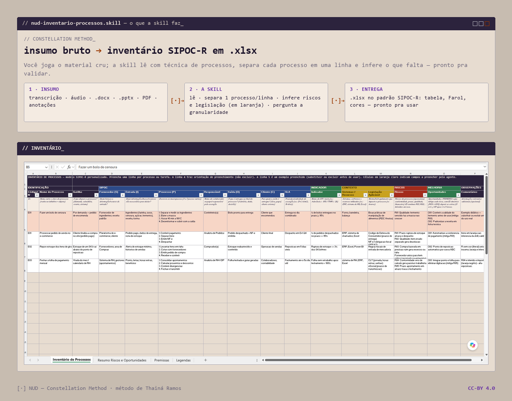

<p align="right"><a href="README.pt-BR.md">🇧🇷 Português</a></p>

<picture>
  <source media="(prefers-color-scheme: dark)" srcset="assets/banner-night.png">
  
</picture>

# nud-inventario-processos

[](https://creativecommons.org/licenses/by/4.0/)

A **skill for Claude** (Anthropic) that turns raw inputs — transcripts, audio, `.pptx`, `.docx`, policies, procedures, notes and PDF flowcharts — into a **Process Inventory** in the **SIPOC-R** model, delivered as a ready-to-use `.xlsx`.

Part of the **NUD | Constellation Method**, by Thainá Ramos.

> **Compatibility:** packaged as a **Claude Skill** (Anthropic's Agent Skills format — it triggers on its own in Claude Code / claude.ai). The **method is model-agnostic**: the same content works in **any chat LLM** by pasting `SKILL.md` + `references/` as context, and `builder.py` runs on **any Python** (e.g. ChatGPT's Code Interpreter).

---

## What it does

- Reads the input with process technique and **puts each process on its own row** (one owner per row).
- Fills the **SIPOC-R** model: Supplier · Input · Process · Owner · Output · Customer, plus SLA, Indicator, Systems, Legislation, Risks, Opportunities.
- **Infers risks (FMEA-inspired, severity only) and applicable legislation**, marking every inference by text COLOR (orange) and a continuous ID (R01, O01) for you to validate — it never presents a guess as fact.
- Chooses the **granularity level** (N1 macro · N2 per handoff · N3 intra-station) by asking the user, with the most likely suggestion.
- Delivers an **Excel that matches the model exactly** (table, colors, structure).

> **SIPOC-R = SIPOC + Risks** — the NUD Risk extension. It is not the "R" for *Requirements*.

For the consolidated risk analysis (prioritized matrix, root cause, executive view), use the companion skill **[nud-diagnostico-de-riscos](https://github.com/whatevertr/skill-nud-diagnostico-de-riscos)**.

## Structure

```
nud-inventario-processos/
├── SKILL.md                         # skill instructions
├── assets/
│   └── Modelo_Inventario_Processos.xlsx   # output model (example: "Bake a cake")
├── references/                      # process technique, field mapping, inference, builder
└── scripts/
    └── builder.py                   # generates the .xlsx from the rows
```

## Install

Copy the `nud-inventario-processos/` folder into your Claude skills directory (`.claude/skills/`) and the skill starts triggering on the cues described in `SKILL.md`.

## Example

The model ships a neutral example process — **"Bake a carrot cake"** — so you can see the fill-in before running it with your own processes. Replace or delete the example row before real use.

## License

[CC-BY-4.0](LICENSE). Free to use, with attribution.

---

*NUD (Constellation Method) — a method by Thainá Ramos (Nud by Whatevertr) · <https://github.com/whatevertr> · Licensed under CC-BY-4.0.*
